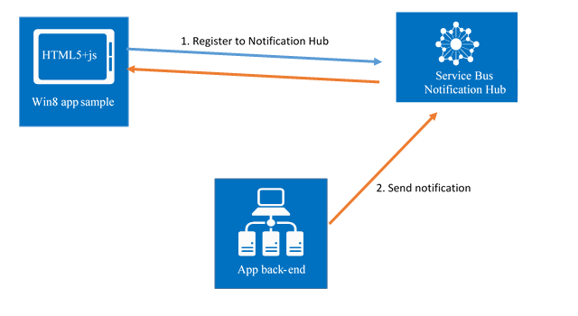
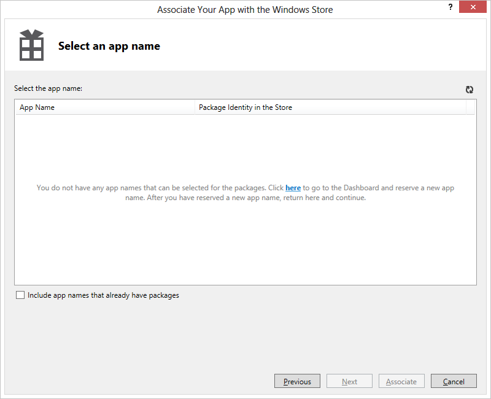
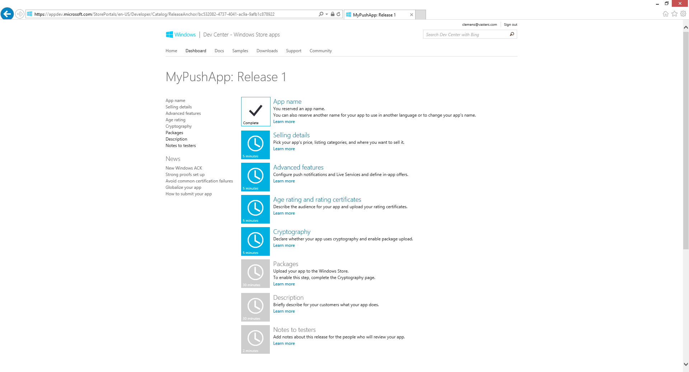
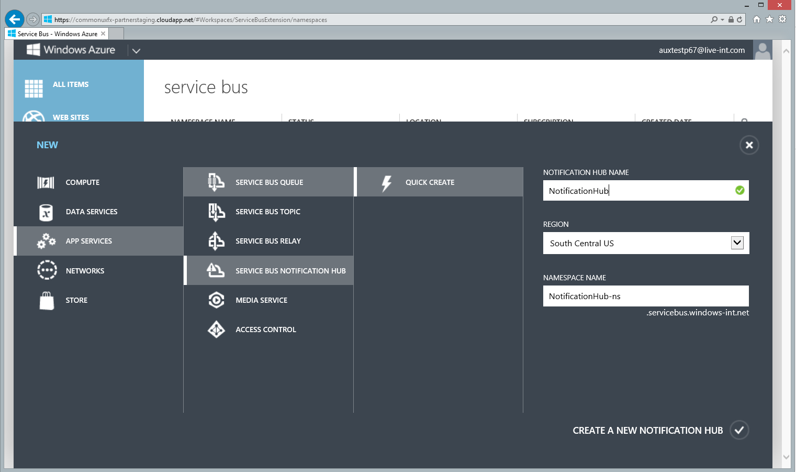
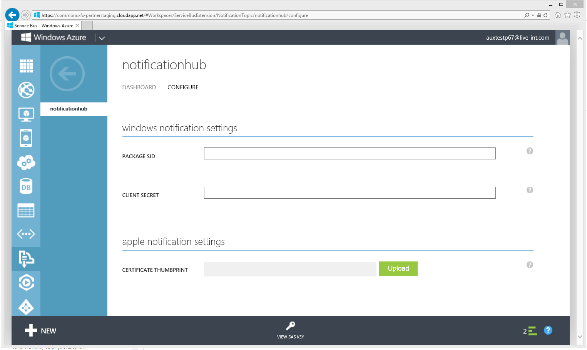

# Service Bus Notification Hub - HTML5+Javascript Sample
## Requires
* Visual Studio 2012
## License
* Apache License, Version 2.0
## Technologies
* REST
* Microsoft Azure
* .NET Framework
* Service Bus
* push notifications
* Windows 8
* Live Tile Notification
* Windows Store app
* Windows Push Notification Service
## Topics
* Service Bus
* push notifications
* Windows Azure Service Bus
* Windows Push Notification Service
## IsPublished
* True
## ModifiedDate
* 2013-05-10 02:23:12
## Description

<h1>Introduction</h1>

<strong>Note</strong>: This sample&nbsp;has been updated to work with Notification Hubs created after April 2013 and it will not work with Notification Hubs created before April 2013. Please update create new Notification Hubs to take advantage of the new
 features we just released!

Service Bus Notification Hub - HTML5 and Javascript sample provides a simple WinJS implementation of the REST surface of Notification Hubs that is used to register Windows 8 devices. The purpose of this sample is to enable Windows 8 apps written in HTML5
 and Javascript to receive push notifications send through Service Bus Notification Hubs.&nbsp; This sample code allows a Windows 8 app written in HTML5 and Javascript to register for native and template notifications on Service Bus Notification Hubs.

This is sample is a simple Windows Store app written in HTML5 and Javascript that registers to a Notification Hub. Follow the instructions below to push native notifications to the sample app and to learn how to use this code in your own HTML5&#43;Javascript
 app.

<strong>Disclaimer</strong>: This sample&nbsp;is *not* the official WinJS SDK for Notification Hubs, which will be available soon,&nbsp;and its use comes with no guarantees.

<h1>Building the sample</h1>

Developers already familiar with Service Bus Notification Hubs can skip to the next section that explains how to use this sample in your own application.

Make sure you have the following prerequisites:

<ol>
<li><a href="http://go.microsoft.com/fwlink/?LinkId=257546" target="_blank">Visual Studio 2012 Express for Windows 8</a>
</li><li><strong>A Windows Store developer account</strong>. To sign up for a Windows Store developer account, start here:
<a href="https://appdev.microsoft.com/StorePortals/en-us/Account/Signup/Start/">https://appdev.microsoft.com/StorePortals/en-us/Account/Signup/Start/</a>
</li><li><strong>Service Bus .NET Preview SDK</strong>. The package is entitled &ldquo;ServiceBus preview features&rdquo; and it contains a new Service Bus library named &ldquo;Microsoft.ServiceBus.Preview.dll.&rdquo; This library should be used instead of the production
 version (&ldquo;Microsoft.ServiceBus.dll&rdquo;) in order to use Notification Hubs.
</li></ol>

<strong>Associate the sample with a Windows Store app</strong>

<ol>
<li>Open the sample solution &lsquo;NotificationHubWinJSApp&rsquo; </li><li>Open the context menu on the project node (i.e. right-click) and find the <em>
Store </em>submenu; after you select <em>Associate App with the Store</em>, a wizard window will pop up and guide you through associating this project with a Windows Store app registration. After the Sign-In step that requires a Windows Store developer account,
 you&rsquo;ll land at a page that shows your existing apps. Select the one you want to associate with the Notification Hub HTML5 and Javascript sample app. (Follow the link to the Windows Store developer dashboard if you have no registered Windows Store app). 

</li></ol>

<strong>Create and configure a Service Bus Notification Hub</strong>

<ol>
<li>In the Windows Store developer dashboard, select your app. </li><li>Skip to the <em>Advanced Features</em> step. </li><li>
</li><li>Click that step and then follow the link to <em>Push notifications and Live Connect services 
info</em>, which lands you here: </li><li>
</li><li>In the push notifications section, click <em>Authenticating your service</em>. On the following page you will find two important pieces of information, which you will need to make a note of as you will need them shortly: The
<em>Package Security Identifier (SID)</em> and the <em>Client secret</em>. </li><li>Go to the Windows Azure management portal (<a href="https://manage.windowsazure.com/">https://manage.windowsazure.com/</a>)
</li><li>Click <em>NEW </em>in the bottom-left corner of the page </li><li>Navigate to <em>App Services &gt; Service Bus Notification Hub &gt; Quick Create</em> and select a name for the Notification Hub, a geographic region indicating the datacenter, and the Service Bus namespace in which the Notification Hub will be created.
 If there are no namespaces available, a new one with the desired name will be 
provisioned. </li><li>
</li><li>To create the Notification Hub, click the check mark. Now, after selecting the Service Bus tab on the left navigation pane, click on the newly created (or reused) namespace. The new Notification Hub will 
appear in the list. </li><li>
</li><li>Click on the Notification Hub, which gets you to the Notification Hub&rsquo;s overview page and then click on the
<em>Configure</em> tab on the top. </li><li>
</li><li>Here, you insert the Package SID and Client Secret you took a note of navigating the Windows Store portal a minute ago; once you&rsquo;re done, click Save in the bottom toolbar.
</li><li>Click the <em>View SAS Key</em> button on the bottom. Take a note of these two key values, which are used to gain access to the Notification Hub at runtime. You will need these keys as we complete the scenario.
</li></ol>

<strong>Configure the sample app to register to your Notification Hub</strong>

<ol>
<li>In Visual Studio, open the file js/default.js, and substitute the parameters in the angle brackets with your namespace name, your notification hub name, and the value of your default listen access key you 
just collected from the Windows Azure portal: 

JavaScript

Edit|Remove

js
<pre class="hidden">var hub = new messaging.NotificationHub(&quot;https://&lt;your namespace&gt;.servicebus.windows.net/&quot;, &quot;&lt;your listen SAS key&gt;&quot;, &quot;&lt;your hub path&gt;&quot;);</pre>

<pre class="js">var&nbsp;hub&nbsp;=&nbsp;new&nbsp;messaging.NotificationHub(&quot;https://&lt;your&nbsp;namespace&gt;.servicebus.windows.net/&quot;,&nbsp;&quot;&lt;your&nbsp;listen&nbsp;SAS&nbsp;key&gt;&quot;,&nbsp;&quot;&lt;your&nbsp;hub&nbsp;path&gt;&quot;); </pre>

</li><li>Run the app, and make sure that the registration succeeds. </li></ol>

<strong>Send a test notification with a console app</strong>

<ol>
<li>In Visual Studio, create a new Windows Console App </li><li>In Solution Explorer, right-click References, and select Manage NuGet packages. Search for &ldquo;Service Bus preview&rdquo;, and install the package titled &ldquo;Service Bus preview features&rdquo;.
</li><li>At the top of any C# file where you want to use Service Bus add the following lines: 

C#

Edit|Remove

csharp
<pre class="hidden">using System.Runtime.Serialization;
using Microsoft.ServiceBus;
using Microsoft.ServiceBus.Messaging;
using Microsoft.ServiceBus.Notifications;</pre>

<pre class="csharp">using&nbsp;System.Runtime.Serialization;&nbsp;
using&nbsp;Microsoft.ServiceBus;&nbsp;
using&nbsp;Microsoft.ServiceBus.Messaging;&nbsp;
using&nbsp;Microsoft.ServiceBus.Notifications;</pre>

</li></ol>
<ol>
<li>In your main method copy the following code, and substitute the parameters in the angle brackets with your namespace name, your notification hub name, and the value of your default full access key that you just collected from the Windows Azure portal: 

C#

Edit|Remove

csharp
<pre class="hidden">static void Main(string[] args)
{
    var cn = ServiceBusConnectionStringBuilder.CreateUsingSharedAccessSecretWithFullAccess(&quot;&lt;your
namespace&gt;&quot;, &quot;&lt;your full access SAS key&gt;&quot;);
    var hubClient = NotificationHubClient.CreateClientFromConnectionString(cn, &quot;&lt;your notification hub path&gt;&quot;);
    var notificationBody = WindowsNotificationXmlBuilder.CreateToastText01Xml(&quot;Hello!&quot;);
    hubClient.SendWindowsNativeNotification(notificationBody);
}
</pre>

<pre class="csharp">static&nbsp;void&nbsp;Main(string[]&nbsp;args)&nbsp;
{&nbsp;
&nbsp;&nbsp;&nbsp;&nbsp;var&nbsp;cn&nbsp;=&nbsp;ServiceBusConnectionStringBuilder.CreateUsingSharedAccessSecretWithFullAccess(&quot;&lt;your&nbsp;
namespace&gt;&quot;,&nbsp;&quot;&lt;your&nbsp;full&nbsp;access&nbsp;SAS&nbsp;key&gt;&quot;);&nbsp;
&nbsp;&nbsp;&nbsp;&nbsp;var&nbsp;hubClient&nbsp;=&nbsp;NotificationHubClient.CreateClientFromConnectionString(cn,&nbsp;&quot;&lt;your&nbsp;notification&nbsp;hub&nbsp;path&gt;&quot;);&nbsp;
&nbsp;&nbsp;&nbsp;&nbsp;var&nbsp;notificationBody&nbsp;=&nbsp;WindowsNotificationXmlBuilder.CreateToastText01Xml(&quot;Hello!&quot;);&nbsp;
&nbsp;&nbsp;&nbsp;&nbsp;hubClient.SendWindowsNativeNotification(notificationBody);&nbsp;
}&nbsp;
</pre>

</li><li>

Run the app and the toast notification should appear!

</li></ol>
<h1>Using the sample code in your app</h1>

If you already have an HTML5 and Javascript app that you want to integrate with Notification Hubs, you can simply extract the NotificationHub.js scripts from the sample and use it in your app. In that case, you still have to make sure to perform the following
 steps:

<ol>
<li>Associate your project with a Windows Store app (step 2 above) </li><li>Create and configure your Notification Hub (steps 3-18 above) </li></ol>

Then, in order to use the class, simply instantiate it with the call:

JavaScript

Edit|Remove

js
<pre class="hidden">var messaging = Microsoft.WindowsAzure.Messaging;
var hub = new messaging.NotificationHub(&quot;https://&lt;your namespace&gt;.servicebus.windows.net/&quot;, &quot;&lt;your listen SAS key&gt;&quot;, &quot;&lt;your hub path&gt;&quot;);</pre>

<pre class="js">var&nbsp;messaging&nbsp;=&nbsp;Microsoft.WindowsAzure.Messaging;&nbsp;
var&nbsp;hub&nbsp;=&nbsp;new&nbsp;messaging.NotificationHub(&quot;https://&lt;your&nbsp;namespace&gt;.servicebus.windows.net/&quot;,&nbsp;&quot;&lt;your&nbsp;listen&nbsp;SAS&nbsp;key&gt;&quot;,&nbsp;&quot;&lt;your&nbsp;hub&nbsp;path&gt;&quot;);</pre>

&nbsp;Assuming familiarity with Notification Hub concepts of registrations, tags, and templates (see next section), you can use the following methods.

To create/update native registrations (just call the method once in the onActivated callback):

JavaScript

Edit|Remove

js
<pre class="hidden">hub.registerApplicationAsync(channelUri);
hub.registerApplicationAsync(channelUri, [&quot;myTag&quot;, &quot;myOtherTag&quot;]);
</pre>

<pre class="js">hub.registerApplicationAsync(channelUri);&nbsp;
hub.registerApplicationAsync(channelUri,&nbsp;[&quot;myTag&quot;,&nbsp;&quot;myOtherTag&quot;]);&nbsp;
</pre>

&nbsp;To delete a registration:

JavaScript

Edit|Remove

js
<pre class="hidden">hub.unregisterApplicationAsync();</pre>

<pre class="js">hub.unregisterApplicationAsync();</pre>

&nbsp;To register for template notifications:

JavaScript

Edit|Remove

js
<pre class="hidden">var toastTemplate = '&lt;toast&gt;&lt;visual&gt;&lt;binding template=&quot;ToastText01&quot;&gt;&lt;text id=&quot;1&quot;&gt;$(message)&lt;/text&gt;&lt;/binding&gt;&lt;/visual&gt;&lt;/toast&gt;';

hub.registerTemplateForApplicationAsync(channelUri, 'toastRegistrationName', [&quot;myTag&quot;, &quot;myOtherTag&quot;], { 'X-WNS-Type': 'wns/toast' }, toastTemplate);</pre>

<pre class="js">var&nbsp;toastTemplate&nbsp;=&nbsp;'&lt;toast&gt;&lt;visual&gt;&lt;binding&nbsp;template=&quot;ToastText01&quot;&gt;&lt;text&nbsp;id=&quot;1&quot;&gt;$(message)&lt;/text&gt;&lt;/binding&gt;&lt;/visual&gt;&lt;/toast&gt;';&nbsp;
&nbsp;
hub.registerTemplateForApplicationAsync(channelUri,&nbsp;'toastRegistrationName',&nbsp;[&quot;myTag&quot;,&nbsp;&quot;myOtherTag&quot;],&nbsp;{&nbsp;'X-WNS-Type':&nbsp;'wns/toast'&nbsp;},&nbsp;toastTemplate);</pre>

&nbsp;To delete template registrations:

JavaScript

Edit|Remove

js
<pre class="hidden">hub.unregisterTemplateForApplicationAsync('toastRegistrationName');</pre>

<pre class="js">hub.unregisterTemplateForApplicationAsync('toastRegistrationName');</pre>

&nbsp;<strong>Note</strong>: all the methods above return WinJS promises and should be called asynchronously (see js/default.js of the provided sample for usage).

<h1>More information</h1>
<ul>
<li><a href="http://go.microsoft.com/fwlink/?LinkId=277072">Notification Hub Fundamentals</a>
</li><li><a href="http://go.microsoft.com/fwlink/?LinkId=277073">Notification Hub Tutorial (Windows Store/.NET)</a>
</li><li><a href="http://go.microsoft.com/fwlink/?LinkId=275828">Notification Hub Feature Guide (Windows Store/.NET)</a>
</li><li><a href="http://channel9.msdn.com/Blogs/Subscribe/Service-Bus-Notification-Hubs-Code-Walkthrough-Windows-8-Edition">Video: Notification Hub Tutorial Walkthrough (Windows Store/.NET)</a>
</li><li><a href="http://channel9.msdn.com/Shows/Cloud&#43;Cover/Episode-100-Introduction-to-the-Windows-Azure-Service-Bus-Notification-Hubs">Video: Cloud Cover 100: Notification Hubs</a>
</li></ul>
